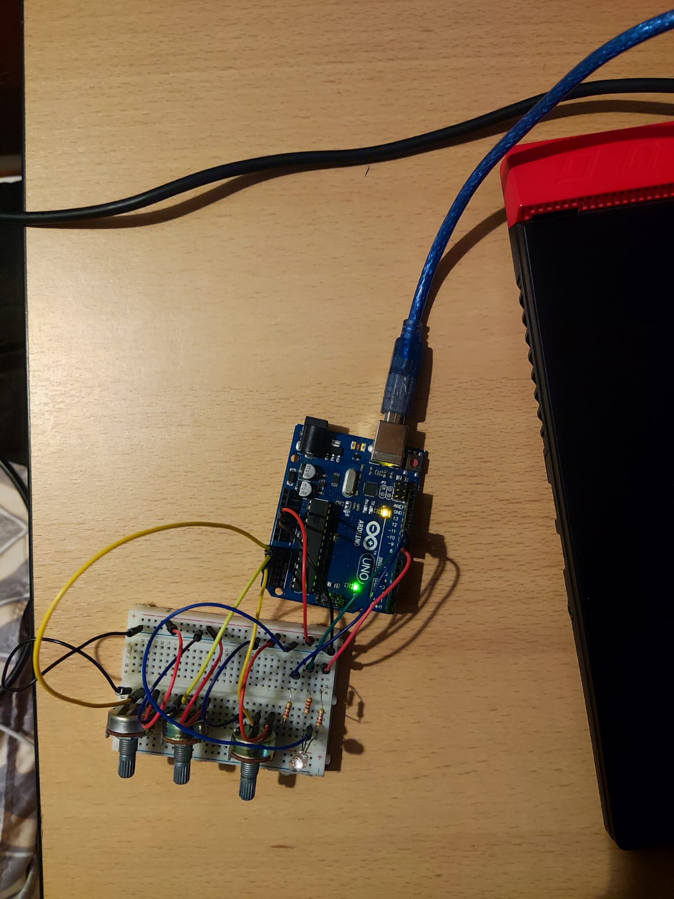

# IntroductionToRobotics
Tasks completed in the Introduction to Robotics course.

### Homework #0
Installing Arduino IDE and setting up this repository.

### Homework #1
#### Task Requirements
Use 3 potentiometers to digitally control a RGB LED.

#### Picture

#### Video
https://youtube.com/shorts/7UpbI1kL0GU?feature=share

