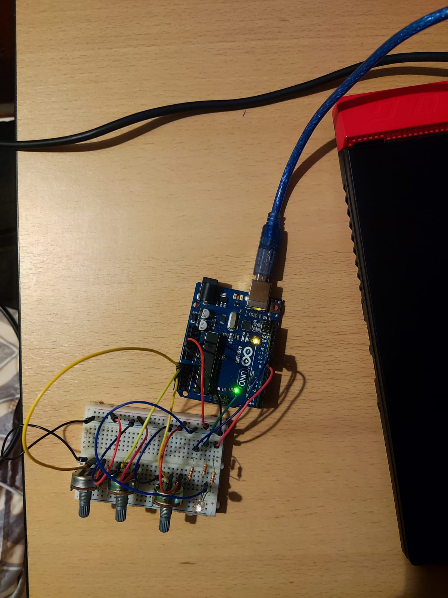
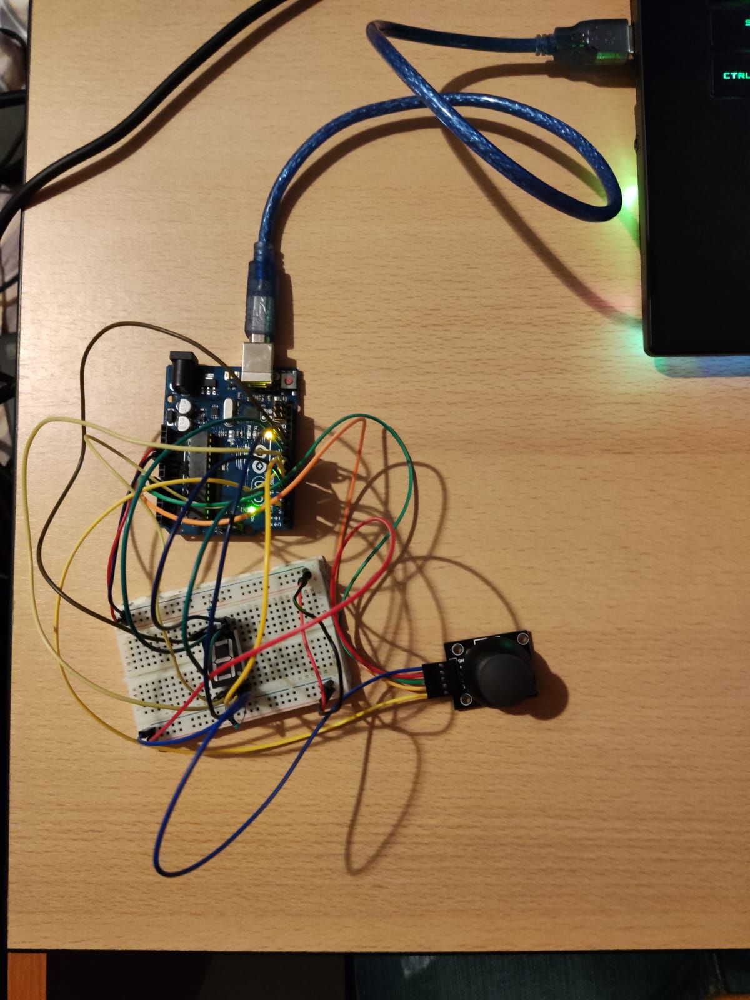
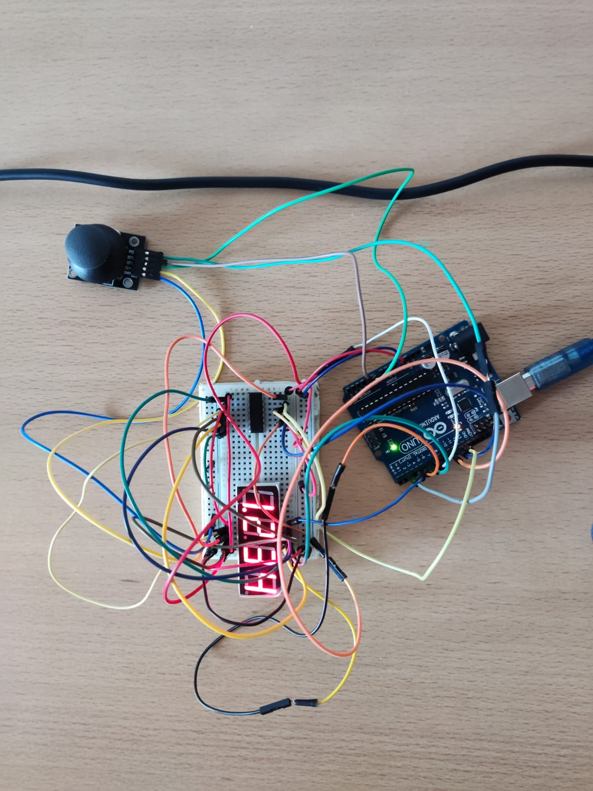
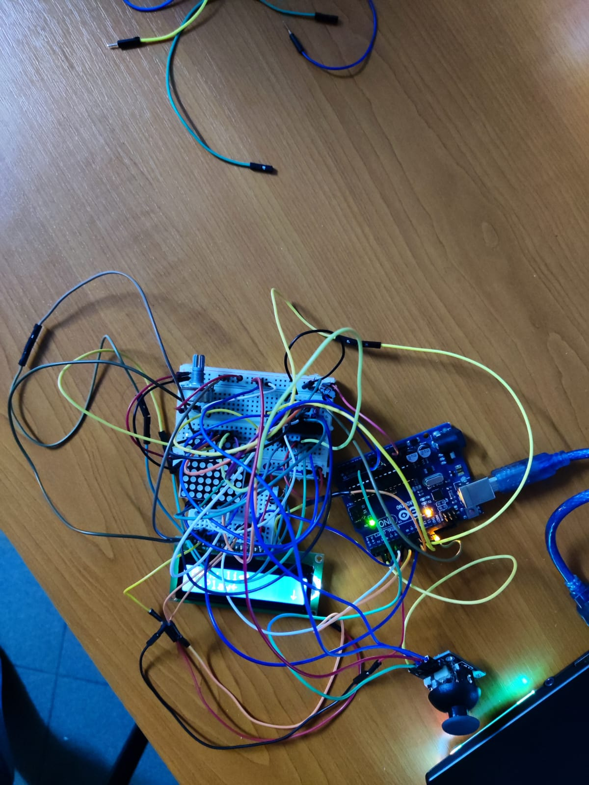

# 🤖 **IntroductionToRobotics: Hands-On Homework Projects** 🔧

Welcome to the **IntroductionToRobotics** repository—a collection of interactive projects designed to bridge theory and practice in robotics. Each homework assignment challenges you with unique tasks, from controlling LEDs to designing interactive displays and even game development. Dive in, explore the details, and enjoy the journey of building and learning!

## Homework Projects 🎓

### Homework #0: Setup & Repository Initialization 🔌
- **Task:** Install the Arduino IDE and set up this repository to get started with your robotics journey.

### Homework #1: RGB LED Control with Potentiometers 🎨
#### Task Requirements
- **Objective:** Use **3 potentiometers** to digitally control an **RGB LED**.

#### Visuals
- **Picture:**  
  
- **Video:**  
  [Watch on YouTube](https://youtube.com/shorts/7UpbI1kL0GU?feature=share)

### Homework #2: Crosswalk Traffic Lights 🚦
#### Task Requirements
Develop a crosswalk traffic light system with these specific states:
- **State 1:** *(Default)*  
  - **Cars:** Green light  
  - **Pedestrians:** Red light  
  - **Sound:** None  
  *(Duration: Indefinite; changes upon button press)*
- **State 2:**  
  - **Cars:** Yellow light  
  - **Pedestrians:** Red light  
  - **Sound:** None  
  *(Duration: 3 seconds, initiated after an 8-second countdown from button press)*
- **State 3:**  
  - **Cars:** Red light  
  - **Pedestrians:** Green light  
  - **Sound:** Constant beeping from the buzzer  
  *(Duration: 8 seconds)*
- **State 4:**  
  - **Cars:** Red light  
  - **Pedestrians:** Blinking green light  
  - **Sound:** Faster beeping than in State 3  
  *(Duration: 4 seconds)*

#### Visuals
- **Picture:**  
  
- **Video:**  
  [Watch on YouTube](https://youtu.be/xUsdk55LEKg)

### Homework #3: Joystick-Controlled Display Drawing 🖌️
#### Task Requirements
Implement a system that uses a joystick to control the position of a segment and “draw” on a display. The project features two main states:

- **State 1:** *(Default)*  
  - The current position blinks.  
  - Use the joystick to move to adjacent positions (ensuring movement only to neighboring segments without crossing “walls”).  
  - **Short Button Press:** Toggles to State 2.  
  - **Long Button Press:** Resets the display (turns all segments OFF) and repositions to the decimal point.

- **State 2:**  
  - The blinking stops, and the segment adopts its previous state (ON/OFF).  
  - Moving the joystick along the selected axis toggles the segment state.  
  - **Joystick Click:** Saves the current segment state and returns to State 1.

#### Visuals
- **Picture:**  
  
- **Video:**  
  [Watch on YouTube](https://youtu.be/Yl7lZxhp6LI)

### Homework #4: 4-Digit 7-Segment Display Control 🔢
#### Task Requirements
Create an interactive system using a joystick to manage a 4-digit 7-segment display:
- **State 1:**  
  - Use one joystick axis to cycle through the 4 digits.  
  - The current digit is highlighted by a blinking decimal point.  
  - **Button Press:** Locks in the current digit and enters State 2.

- **State 2:**  
  - The decimal point stays on (no longer blinking).  
  - The joystick axis now increments or decrements the current digit’s value in hexadecimal (0 to F).  
  - **Note:** Each discrete movement adjusts the number by one step; holding the joystick does not result in continuous change.

- **Reset Functionality:**  
  - Holding the button resets all digit values and returns the position to the first digit in State 1.

#### Visuals
- **Picture:**  
  
- **Video:**  
  [Watch on YouTube](https://youtu.be/xVdoAfX9g8Y)

### Homework #5: Game Development & Menu Design 🎮
#### Task Requirements
- **Objective:** Build an engaging game complete with an interactive menu system.

#### Visuals
- **Picture:**  
  
- **Video:**  
  [Watch on YouTube](https://youtu.be/pq-VQh95DNY)

Feel free to explore each project to gain hands-on experience with robotics programming, hardware interfacing, and interactive design. Happy building and experimenting! 🚀
