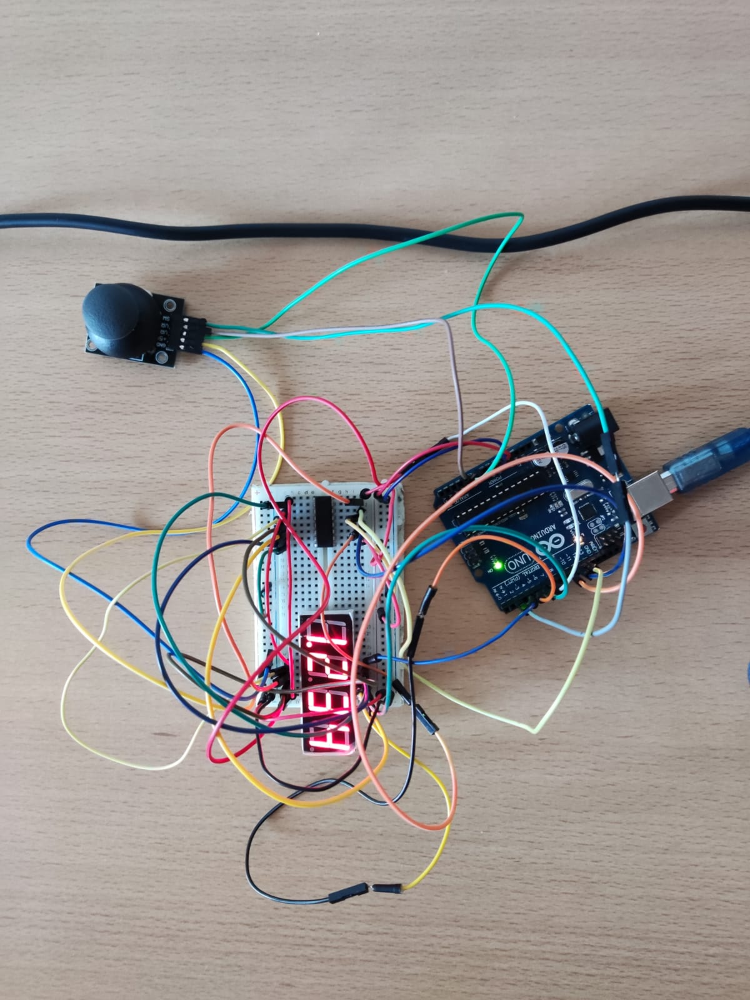

# IntroductionToRobotics
Tasks completed in the Introduction to Robotics course.

### Homework #0
Installing Arduino IDE and setting up this repository.

### Homework #1
#### Task Requirements
Use 3 potentiometers to digitally control a RGB LED.

#### Picture

#### Video
https://youtube.com/shorts/7UpbI1kL0GU?feature=share

### Homework #2
#### Task Requirements
Build the traffic lights for a crosswalk. The system has the following states:
- *State1* (default, reinstated after state 4 ends): green light for cars,
red light for people, no sounds. Duration: indefinite, changed by pressing the button.
- *State2* (initiated by counting down 8 seconds after a button press):
the light should be yellow for cars, red for people and no sounds. Duration: 3 seconds.
- *State3* (initiated after state 2 ends): red for cars, green for people
and a beeping sound from the buzzer at a constant interval. Duration: 8 seconds.
- *State4* (initiated after state 3 ends): red for cars, blinking green
for people and a beeping sound from the buzzer, at a constant interval, faster than the beeping in state 3. This state should last 4 seconds.

#### Picture

#### Video
https://youtu.be/xUsdk55LEKg

### Homework #3
#### Task Requirements
You will use the joystick to control the position of
the segment and ”draw” on the display. The movement between segments
should be natural (meaning they should jump from the current position
only to neighbors, but without passing through ”walls”. The system has the following states:
- *State1* (default, but also initiated after a button press in State
2): Current position blinking. Can use the joystick to move from
one position to neighbors. Short pressing the button toggles state2. Long pressing the button in state 1 resets the entire display by
turning all the segments OFF and moving the current position to the
decimal point.
- *State2* (initiated after a button press in State 1): The current
segment stops blinking, adopting the state of the segment before
selection (ON or OFF). Toggling the X (or Y, you chose) axis should
change the segment state from ON to OFF or from OFF to ON.
Clicking the joystick should save the segment state and exit back to
state 1.

#### Picture

#### Video
https://youtu.be/Yl7lZxhp6LI

### Homework #4
#### Task Requirements
Use the joystick to move through the 4 digit 7
segment displays digits, press the button to lock in on the current digit
and use the other axis to increment or decrement the number. Keep the
button pressed to reset all the digit values and the current position to the
first digit in the first state.
- *State1* you can use a joystick axis to cycle through the 4 digits;
using the other axis does nothing. A blinking decimal point shows
the current digit position. When pressing the button, you lock in on
the selected digit and enter the second state.
- *State2*  in this state, the decimal point stays always on, no
longer blinking and you can no longer use the axis to cycle through
the 4 digits. Instead, using the other axis, you can increment on
decrement the number on the current digit IN HEX (aka from 0
to F, as in the lab). Pressing the button again returns you to the
previous state. Also, keep in mind that when changing the number,
you must increment it for each joystick movement - it should not
work continuosly increment if you keep the joystick in one position
(aka with joyMoved).
- *Reset*  in this state, the decimal point stays always on, no
longer blinking and you can no longer use the axis to cycle through
the 4 digits. Instead, using the other axis, you can increment on
decrement the number on the current digit IN HEX (aka from 0
to F, as in the lab). Pressing the button again returns you to the
previous state. Also, keep in mind that when changing the number,
you must increment it for each joystick movement - it should not
work continuosly increment if you keep the joystick in one position
(aka with joyMoved).

#### Picture

#### Video

